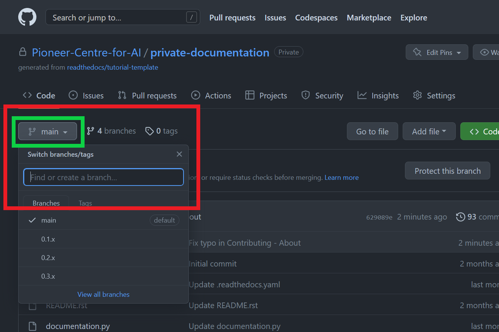

# Contribute

We welcome contributions to the documentation. Before you start, we recommend contacting one of the Github organization owners to discuss your plans. This will help us coordinate our efforts and avoid duplication of work.

Additionally, this also allows us to add you to the organization, so you can work directly on the repository.

## How to contribute

If you are not already familiar with the process of contributing to a Github repository, you can find a detailed guide [here](https://akrabat.com/the-beginners-guide-to-contributing-to-a-github-project/). If you are only going to make a small change, you can use the Github web interface to edit the file directly.

Start by creating a new branch from the branching menu and name it after the feature you want to create

GitHub will prompt you to create a new branch with the name of your feature. Click create branch.

Once on the correct branch - navigate to the file you want to edit and click the edit button to go into editor mode.

Perform your edits, this part can be performed multiple times, and with each commit make sure to put in a title that is
informative and makes sense. If the title is too long feel free to describe your changes in greater details in the
extended description. Make sure you commit to your newly created branch.

Go back to the main repository page and ensure you are still on your own branch. Click "Compare & pull request" to begin the pull request and merging process.

Set the buttons highlighted in green to "base: main" and "compare: $my_branch$". Write an overall message for your pull request and click the "Create pull request"-button.

Once all checks (if any are running) have passed you can click the "Merge pull request"-button or wait until an administrator has approved your pull request. If your pull request did not pass all checks, continue working on your changes until they do.

