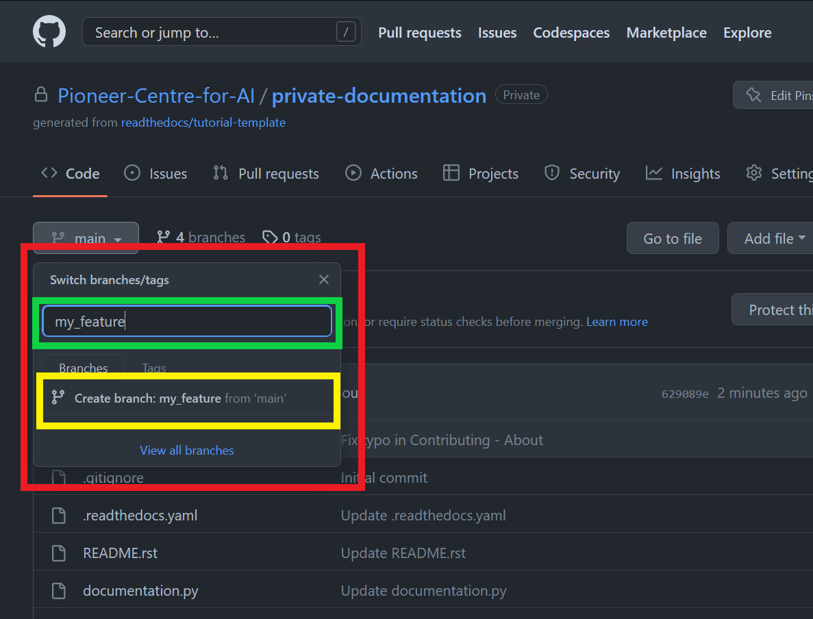
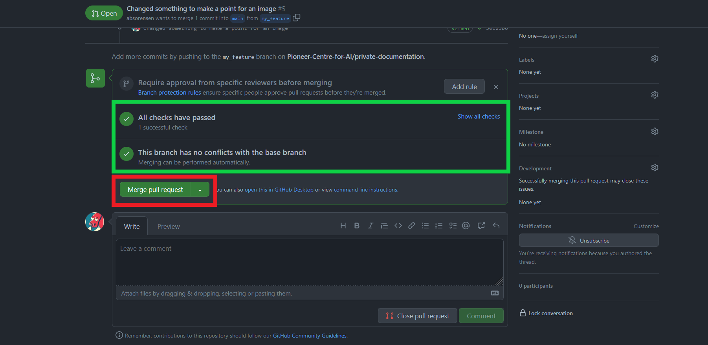

Contributing
############
To get viewing and contribution privileges to this documentation contact one of the GitHub organization owners or the compute coordinator. 
Once you have been added to the GitHub you just have to access one of the links to the documentation in the ReadMe of the repository. 
This will result in a prompt from ReadTheDocs asking for access to your GitHub. 
This will allow for ReadTheDocs to use your GitHub login as authentication.

About
*****
This documentation resource is meant to support sharing of information within P1. 
The heterogeneity of P1 can make it hard to communicate and retain information. 
Slack is simply not the channel and this resource is meant to make it easier to be a researcher at P1.
There are two presentable versions of the documentation. 
One is latest, which is tied to the main branch of the GitHub repository. 
The other version is the stable version which is tied to a specific branch and updated occassionally.

What is ReadTheDocs
*******************
`ReadTheDocs <https://readthedocs.com/>`_ is a system widely used for generating rich documentation. 
This documentation is generated with the paid version in order for us to have private documentation with login control, 
while allowing users access through their GitHub login. 
The repository holding all of the configuration and source files for this documentation is held by a GitHub repository owned by P1's GitHub organization. 
Every time a new update is pushed to the documentation, ReadTheDocs builds the documentation and sends an error message. 
Our ReadTheDocs instance has been configured to also fail on warnings. 
This allows us to catch errors like an image not being found, which is actually a warning. 
ReadTheDocs also allows us to choose which branches from our repository we want as our stable and latest branches.

What is git
***********
Version control.
What are commits and merges.

What is GitHub
**************
GitHub is the most widely used repository hosting service. 
It is also the one that most programmers have an account with. 
ReadTheDocs allows us to administrate access and login to our documentation through GitHub. 
The web based interface also allows for non-technical staff to contribute to the documentation 
without having to learn too much about Git processes or install anything.

GitHub Workflow
***************
This is the easier of the two workflows, but if you are making a larger amount of edits, the git workflow may be faster. 
To contribute on GitHub create a new branch from the branching menu and name it after the feature you want to create. 

.. image:: images/contributing/github_contributing_01.png
  :width: 600
  :alt: Get on the right branch or create a new one.

GitHub will prompt you to create a new branch with the name of your feature. Click create branch.

Once on the correct branch - navigate to the file you want to edit and click the edit button to go into editor mode.

.. image:: images/contributing/github_contributing_03.png
  :width: 600
  :alt: Click the editor button.

Perform your edits, this part can be performed multiple times, and with each commit make sure to put in a title that is informative and makes sense. 
If the title is too long feel free to describe your changes in greater details in the extended description. 
Make sure you commit to your newly created branch.

.. image:: images/contributing/github_contributing_04.png
  :width: 600
  :alt: Make your changes to the text and create an informative commit description.

Go back to the main repository page and ensure you are still on your own branch. Click "Compare & pull request" to begin the pull request and merging process.

Set the buttons highlighted in green to "base: main" and "compare: $my_branch$". Write an overall message for your pull request and click the "Create pull request"-button.

ReadTheDocs will commence building your changes and make sure that your changes are valid. This ensures you don't bring down the main branch with your changes.

.. image:: images/contributing/github_contributing_07.png
  :width: 600
  :alt: ReadTheDocs will build your changes to ensure they are valid.

Once all checks have passed you can click the "Merge pull request"-button or wait until an administrator has approved your pull request. 
If your pull request did not build correctly, continue working on your changes until ReadTheDocs can build your changes.

.. image:: images/contributing/github_contributing_09.png
  :width: 600
  :alt: Optionally add more descriptions and comments to the pull request.

Git Workflow
************
Intro to contributing through git.

Tips and Tricks
***************
If the documents are built, but you don't see an update of the relevant page, highlight the URL at the top of the doc and delete the url until it is just latest and press enter. 
This is likely to show your update.

.. list-table:: Useful Resources
   :widths: 60
   :header-rows: 1

   * - Link
   * - `ReadTheDocs guide <https://docs.readthedocs.io/en/stable/>`_
   * - `Git branch and merge guide <https://docs.github.com/en/repositories/configuring-branches-and-merges-in-your-repository/defining-the-mergeability-of-pull-requests/managing-a-branch-protection-rule>`_
   * - `RST guide <https://sublime-and-sphinx-guide.readthedocs.io/en/latest/index.html>`_

Link to an image
================

Source: 

.. code-block:: RST

  .. image:: images/contributing/github_contributing_06.png
  :width: 600
  :alt: Ensure you are merging from and to the correct branches and create a pull request with an informative description.

Show a code block
=================
Remember the space between the code-block line and your code.

.. code-block:: python

  import numpy as np

Source:

.. code-block:: RST

  .. code-block:: python

    import numpy as np

Link to an external URL
=======================
`ReadTheDocs <https://readthedocs.com/>`_

Source:

.. code-block:: RST

  `ReadTheDocs <https://readthedocs.com/>`_

Link to an internal page
========================
Make sure to use the name of the file in your link.

:doc:`welcome`

Source:

.. code-block:: RST

  :doc:`welcome`

Create a table
==============
.. list-table:: Management
   :widths: 15 35 15 30
   :header-rows: 1

   * - Role
     - Name
     - University
     - Contact
   * - Director
     - Serge Belongie
     - UCPH
     - s.belongie@di.ku.dk
   * - COO
     - Michelle Cumming Løkkegaard
     - UCPH
     - mcl@di.ku.dk

Source:

.. code-block:: RST

  .. list-table:: Management
   :widths: 15 35 15 30
   :header-rows: 1

   * - Role
     - Name
     - University
     - Contact
   * - Director
     - Serge Belongie
     - UCPH
     - s.belongie@di.ku.dk
   * - COO
     - Michelle Cumming Løkkegaard
     - UCPH
     - mcl@di.ku.dk