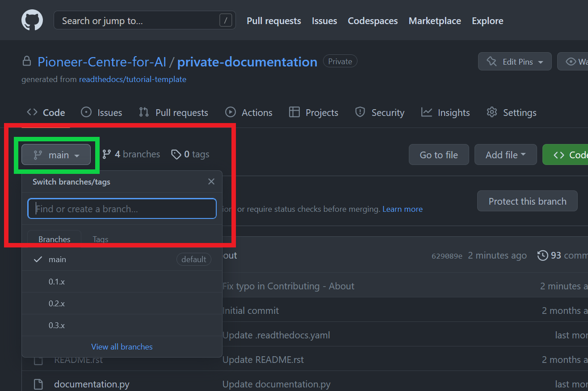
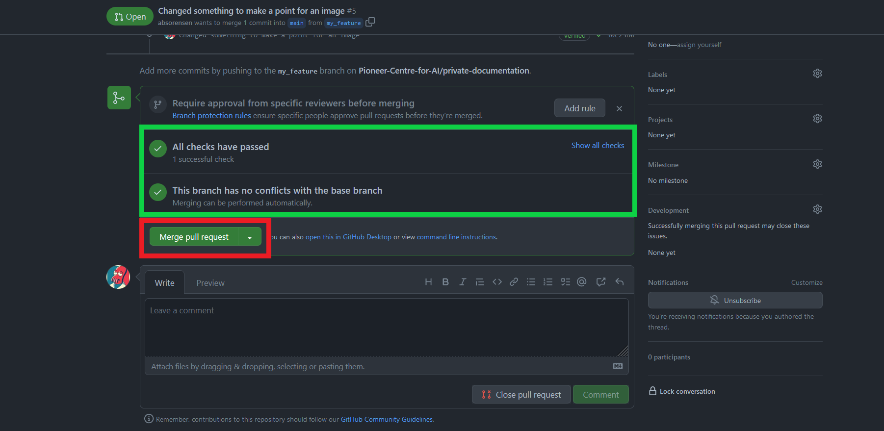

We welcome contributions to this site! Our hopes are that this can act more as a central place for quality information that is easy to find and use, and less as a place that shares unnescary details about the individual clusters.

## Before You Start

**Contact us first:** We recommend reaching out to one of the GitHub organization owners to discuss your plans. This helps us:
- Coordinate efforts and avoid duplicate work
- Add you to the organization for direct repository access
- Provide guidance on your specific contribution

## How to Contribute

If you're making a minor edit like fixing typos, updating links, or making small improvements, you can use GitHub's web interface directly. Simply navigate to the file you want to edit, click the edit button, make your changes, and commit them.

For more substantial contributions, follow these steps:

#### 1. Create a New Branch
- Navigate to the main repository page
- Click the branch dropdown menu
- Name your branch descriptively (e.g., `fix-typo-in-contribute-page` or `add-new-cluster-documentation`)
- Click "Create branch"

#### 2. Edit Your Files
- Navigate to the file you want to edit
- Click the edit button (pencil icon) to enter edit mode
- Make your changes
- Write a clear, descriptive commit message
- Commit to your branch

#### 3. Create a Pull Request
- Return to the main repository page
- Ensure you're on your branch
- Click "Compare & pull request"

#### 4. Submit Your Changes
- Set base branch to `main` and compare to your branch
- Write a clear title and description of your changes
- Click "Create pull request"

#### 5. Wait for Review
- All checks must pass before merging
- An administrator will review your changes
- Once approved, your changes will be merged

## Need Help?

If you're new to contributing to GitHub projects, check out this [detailed beginner's guide](https://akrabat.com/the-beginners-guide-to-contributing-to-a-github-project/).

## Tips for Great Contributions

- **Write clear commit messages** that explain what and why you changed
- **Test your changes** locally if possible
- **Keep changes focused** - one pull request per feature or fix
- **Follow existing formatting** and style conventions
- **Add context** in your pull request description

Thank you for contributing to our documentation!
